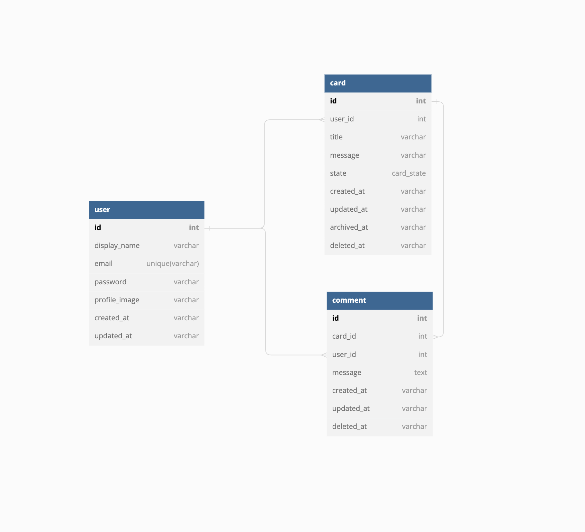

## Demo card service

### Repository structure

| Type     | Name                  | Description                                         |
| :------- | :-------------------- | :-------------------------------------------------- |
| `folder` | `api`                 | Api service (NestJs)                                |
| `folder` | `mnt`                 | Mount volume container mysql service                |
| `file`   | `.env`                | ไฟล์ env สำหรับ docker-compose.yaml                 |
| `file`   | `docker-compose.yaml` | ไฟล์ สำหรับ run container api, mysql                |
| `file`   | `dev.sh`              | ไฟล์ script สำหรับ run docker-compose ไฟล์ dev mode |

### Environment variables

ไฟล์ `/.env`
| Parameter | Type | Description |
| :-------- | :------- | :------------------------- |
| `API_EXTERNAL_PORT`| `number` | **Required**. PORT สำหรับเข้าถึงจากภายนอก |
| `API_INTERNAL_PORT` | `number` | **Required**. PORT container|

ไฟล์ `/.env`
| Parameter | Type | Description |
| :-------- | :------- | :------------------------- |
| `PORT`| `number` | **Required**. PORT container |
| `MYSQL_PROTOCOL` | `string` | **Required**. mysql|
| `MYSQL_USER` | `string` | **Required**. root|
| `MYSQL_PASSWORD` | `string` | **Required**. 1234|
| `MYSQL_HOST` | `string` | **Required**. |
| `MYSQL_PORT` | `string` | **Required**. |
| `MYSQL_LOGGING` | `string` | 1 = show sql log, 0 = none |
| `MYSQL_DATABASE` | `string` | **Required**. demo_app_001 |
| `JWT_SECRET` | `string` | **Required**. |
| `UPLOADED_DESTINATION` | `string` | **Required**. dir สำหรับเก็บรูปภาพ |
| `CDN_BASE_URL` | `string` | **Required**. URL สำหรับ serve static content (http://localhost:3001) |

### Database schema



### How to run

For dev mode

```bash
  ./dev.sh
```

For production mode

```bash
  ./production.sh
```

### API Enpoint

Postman Collection แนบตัวอย่าง Request, Response [โหลดไฟล์](doc/demo_app_001.postman_collection.json)

Postman Env [โหลดไฟล์](doc/demo.postman_environment.json)

| Method   | Endpoint                                    | Authentication | Description                                                                               |
| :------- | :------------------------------------------ | :------------- | :---------------------------------------------------------------------------------------- |
| `POST`   | `/auth/sign-up`                             |                | สำหรับสมัครสามารถใช้งาน                                                                   |
| `POST`   | `/auth/sign-in`                             |                | สำหรับเข้าใช้งาน(Login) -> id token (JWT)                                                 |
| `GET`    | `/auth/user`                                | **Required**   | ตรวจสอบ id token ยัง valid อยู่                                                           |
| `PATCH`  | `/auth/user/profile-image`                  | **Required**   | สำหรับอัพเดท profile image                                                                |
| `POST`   | `/card`                                     | **Required**   | สำหรับสร้างการ์ด                                                                          |
| `GET`    | `/card`                                     | **Required**   | สำหรับดึงข้อมูลการ์ด                                                                      |
| `PATCH`  | `/card`                                     | **Required**   | สำหรับอัพเดทการ์ด                                                                         |
| `DELETE` | `/card`                                     | **Required**   | สำหรับลบการ์ด                                                                             |
| `GET`    | `card/pagination?page=1&perpage=10`         | **Required**   | สำหรับดังข้อมูลการ์ด มีการแบ่งหน้าสำหรับโหลดเพิ่ม และ ค้นหาข้อมูลจำเป็น เช่น state, title |
| `PATCH`  | `/card/state`                               | **Required**   | สำหรับปรับสถานะการ์ด                                                                      |
| `PATCH`  | `/card/archive`                             | **Required**   | สำหรับจัดเก็บการ์ดถาวร                                                                    |
| `POST`   | `/card/comment`                             | **Required**   | สำหรับสร้างตอบการ์ด                                                                       |
| `PATCH`  | `/card/comment`                             | **Required**   | สำหรับอัพเดทคอมเม้นต์                                                                     |
| `DELETE` | `/card/comment`                             | **Required**   | สำหรับลบคอมเม้นต์                                                                         |
| `GET`    | `card/comment/pagination?page=1&perpage=10` | **Required**   | สำหรับดังข้อมูลคอมเม้นต์ มีการแบ่งหน้าสำหรับโหลดเพิ่ม                                     |
